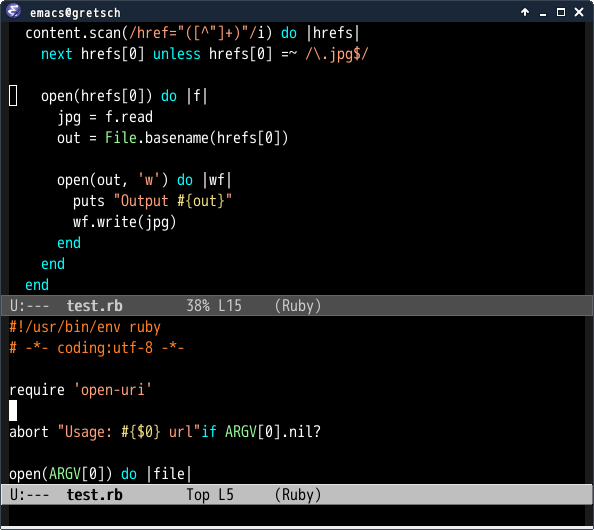
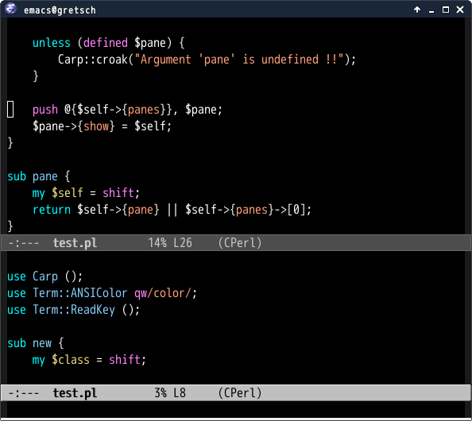

# import-popwin.el

## Introduction
`import-popwin.el` pops up buffer near by import statements with [popwin.el](https://github.com/m2ym/popwin-el).
We often fix import statements in any languages. `import-popwin.el` helps you in such case.


## Screenshot

### import-popwin with ruby-mode


### import-popwin with cperl-mode



## Requirements

* Emacs 24 or higher
* [popwin.el](https://github.com/m2ym/popwin-el) 0.6 or higher


## Basic Usage

#### `import-popwin`

Pop up buffer near by import statements


## Default support modes

* c-mode
* c++-mode
* perl-mode, cperl-mode
* ruby-mode
* python-mode
* emacs-lisp-mode


## Add own configuration

```elisp
(import-popwin:add :mode 'java-mode
                   :regexp "^import\\s-")
```

You can override default setting.

```elisp
(import-popwin:add :mode '(perl-mode cperl-mode)
                   :regexp "^\\(use\\|require\\)-")
```

## Configuration Parameters

### Mandatory Parameter

#### :mode

Specified mode for this configuration.

#### `:regexp`

Regexp for searching import statement.

Optional Parameter

#### `:before`

Function which is called before popup buffer.

#### `:fallback`

Function which is called if to search import statement with `:regexp` is failed.

#### `:after`

Function which is called after popup buffer.


## Hooks

#### `import-popwin:common-before-hook`

Common hooks called before popup window.
This hook is run before each language `:before` functon

#### `import-popwin:common-after`

Common hooks called after popup window
This hook is run before each language `:after` functon
